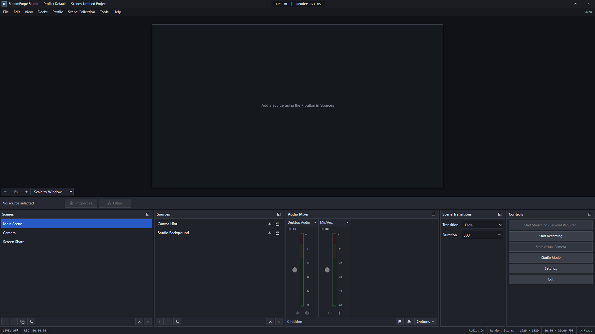

# StreamForge Studio

[](https://github.com/VivaanRajpurohit/StreamForge-Studio/actions/workflows/ci.yml)


StreamForge Studio is a production-minded, browser-based composition and recording workspace. It brings an OBS-inspired desktop workflow to the web while keeping projects, capture streams, uploaded media, and recordings on the user's device.

**Live app:** [streamforge-live-studio.vercel.app](https://streamforge-live-studio.vercel.app)



## Highlights

- OBS-style workspace with compact menus, preview, source controls, resizable docks, and status telemetry
- Multiple scenes with ordered, visible, lockable sources
- Display, webcam, microphone, image, video, text, browser, color, audio, and group sources
- Live Canvas 2D composition with selection, dragging, snapping, resizing, rotation, opacity, and crop controls
- Vertical Web Audio mixer with per-source gain, meters, mute controls, and mixed recording audio
- Local WebM recording with pause/resume and feature-detected codecs
- Studio Mode with independent Preview and Program scene state
- IndexedDB autosave, versioned migrations, validated JSON import/export, and undo/redo history
- Persisted, hideable, resizable dock layout
- Hydration-safe browser capability reporting and accessible dialogs and controls

## Quick start

Requirements: Node.js 24 and a recent desktop Chrome or Edge browser.

```bash
git clone https://github.com/VivaanRajpurohit/StreamForge-Studio.git
cd StreamForge-Studio
npm install
npm run dev
```

Open [http://localhost:3000](http://localhost:3000) at a viewport of at least 1280x720.

## Quality commands

```bash
npm run typecheck
npm run lint
npm test
npm run build
npm run test:e2e
```

The GitHub Actions workflow runs the same checks for pushes and pull requests.

## Architecture

```text
src/components/studio   React shell, docks, dialogs, and canvas interactions
src/store               Zustand project state and bounded history
src/engine/compositor   Canvas 2D render loop
src/engine/media        MediaDevices, runtime registry, and Web Audio graph
src/engine/recording    MediaRecorder lifecycle and codec detection
src/engine/persistence  IndexedDB repository and project migrations
```

The serializable project model is deliberately separate from runtime browser media objects. The compositor reads the latest store state without pushing video frames through React. See [ARCHITECTURE.md](./ARCHITECTURE.md) for the full design.

## Privacy and browser constraints

StreamForge does not upload captured content. Browser permission prompts are always user initiated, and removing or exiting a project stops media tracks and revokes object URLs.

The hosted surface has no authentication, public mutation API, database, or server-side media storage. Production responses include a restrictive Content Security Policy, permissions policy, anti-framing controls, MIME-sniffing protection, and HSTS. See [SECURITY.md](./SECURITY.md) for private vulnerability reporting.

System-audio availability, recording codecs, and browser-source embedding vary by platform and browser. Direct RTMP credentials are intentionally unsupported; production streaming should use authenticated WebRTC ingest and a server-side media gateway. See [BROWSER_SUPPORT.md](./BROWSER_SUPPORT.md).

## Contributing

Contributions are welcome. Read [CONTRIBUTING.md](./CONTRIBUTING.md) and run the complete quality suite before opening a pull request.
